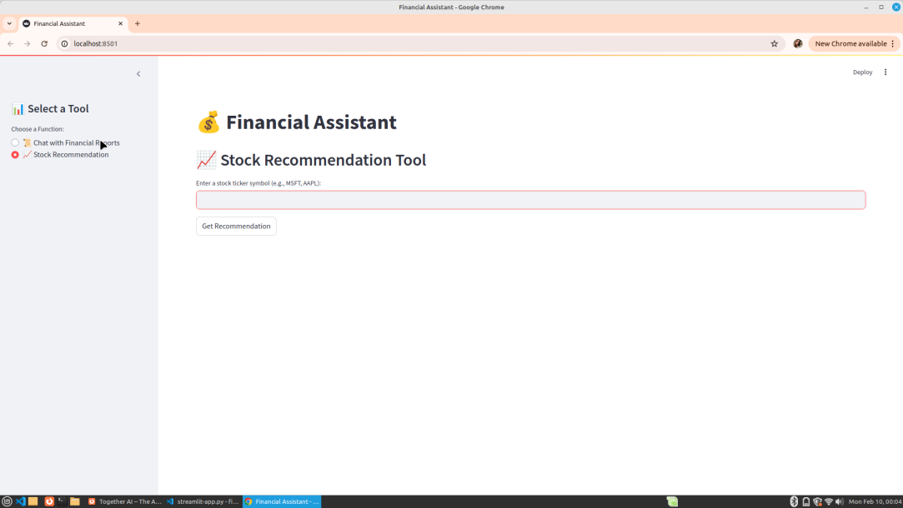

# Financial Agent

## 📌 Overview
Financial Agent is a **Multi-Agent Retrieval-Augmented Generation (RAG) System** that provides:
1. **Chatbot for Financial Reports** 📜 → Uses an **LLM (LLaMA 3.3 70B)** to answer questions based on indexed financial reports.
2. **Stock Recommendation Tool** 📈 → Analyzes stock trends and provides investment recommendations using **BERT for sentiment analysis** on financial news.
3. **Streamlit UI** 🖥️ → Provides a simple web interface to interact with the system.

This system leverages **multiple AI agents**, each specialized in a different financial task, ensuring accurate and dynamic insights.

---

## 🚀 Features
✅ **Multi-Agent RAG System** → Combines multiple AI models for enhanced accuracy.  
✅ **FastAPI-powered backend** for handling requests efficiently.  
✅ **ChromaDB for semantic search** in financial reports.  
✅ **LLaMA 3.3 70B via Together AI** for natural language responses.  
✅ **Stock market analysis** using Yahoo Finance (`yfinance`).  
✅ **Sentiment analysis with BERT** (`distilbert-base-uncased-finetuned-sst-2-english`) for news-based stock recommendations.  
✅ **Streamlit interface** for an intuitive user experience.  

🔹 **Note:** Currently, the ChromaDB contains only the **Apple 2024 annual report**. Future enhancements will include more financial reports.

---

## 🛠 Installation
### **1️⃣ Clone the Repository**
```bash
git clone https://gitlab.com/chetouaniliza1/financial_agent.git
cd financial_agent
```

### **2️⃣ Create a Virtual Environment (Recommended)**
```bash
python3 -m venv venv
source venv/bin/activate  # On Windows: venv\Scripts\activate
```

### **3️⃣ Install Dependencies**
```bash
pip install -r requirements.txt
```

### **4️⃣ Set Environment Variables**
#### ➜ Create a `.env` file with the following:
```ini
TOGETHER_API_KEY=your_together_ai_api_key
```
Alternatively, set it in the terminal:
```bash
export TOGETHER_API_KEY="your_together_ai_api_key"
```

---

## 🔥 Running the Application
### **1️⃣ Start the FastAPI Backend**
```bash
uvicorn app:app --host 127.0.0.1 --port 8000 --reload
```
🚀 **FastAPI will now run on** `http://127.0.0.1:8000`

---

## 💡 LLM Integration (LLaMA 3.3 70B)
### **How It Works**
1. **Financial reports are indexed in ChromaDB** using `sentence-transformers/all-MiniLM-L6-v2`.
2. **When a question is asked**:
   - The query is embedded and matched with the most relevant passages in ChromaDB.
   - **Top 5 passages** are selected and sent to the **LLaMA 3.3 70B model** via Together AI.
   - The model generates a **natural language response** based on the retrieved data.

### **Endpoint: `/ask`** (LLM-powered Chatbot)
- **Method:** `GET`
- **Usage:** Ask a question about financial reports.
- **Example Call:**
  ```bash
  curl "http://127.0.0.1:8000/ask?query=What%20is%20Apple%27s%20revenue%20in%202024?"
  ```
- **Example Response:**
  ```json
  {
    "response": "Apple's revenue for 2024 is $XXX billion, as reported in the annual filing."
  }
  ```

---

## 📈 Stock Recommendation System
### **How It Works**
1. Fetches stock market data using `yfinance`.
2. **Performs sentiment analysis using BERT** (`distilbert-base-uncased-finetuned-sst-2-english`) on financial news.
3. Analyzes price trends and combines both insights to make a recommendation.

### **Endpoint: `/recommend`** (Stock Market Analysis)
- **Method:** `GET`
- **Usage:** Get a recommendation for a specific stock ticker.
- **Example Call:**
  ```bash
  curl "http://127.0.0.1:8000/recommend?ticker=AAPL"
  ```
- **Example Response:**
  ```json
  {
    "recommendation": "BUY"
  }
  ```

---

## 🖥️ Running the Streamlit Interface
### **1️⃣ Start Streamlit UI**
```bash
streamlit run streamlit-app.py
```
📌 **The UI will be accessible at** `http://localhost:8501`

### **2️⃣ Features of the UI**
- **Chat with Financial Reports** 📜 → Enter a question & get a response.


- **Stock Recommendation** 📈 → Enter a stock ticker & get investment advice.

---

## 📌 Future Improvements
✅ **Add support for multiple financial reports**.  
✅ **Improve stock analysis using sentiment from real-time news**.  
✅ **Enhance UI with visual analytics for stock trends**.  

---

## 🎯 Contributors

 CHETOUANI Liza
 DORBANE Sara
 BOUFADES Lina

